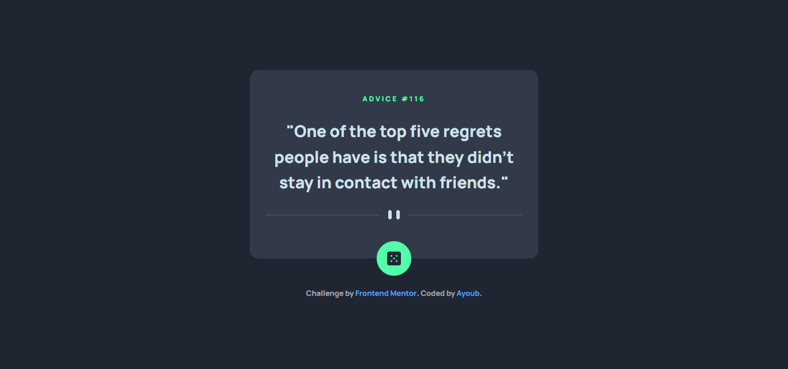
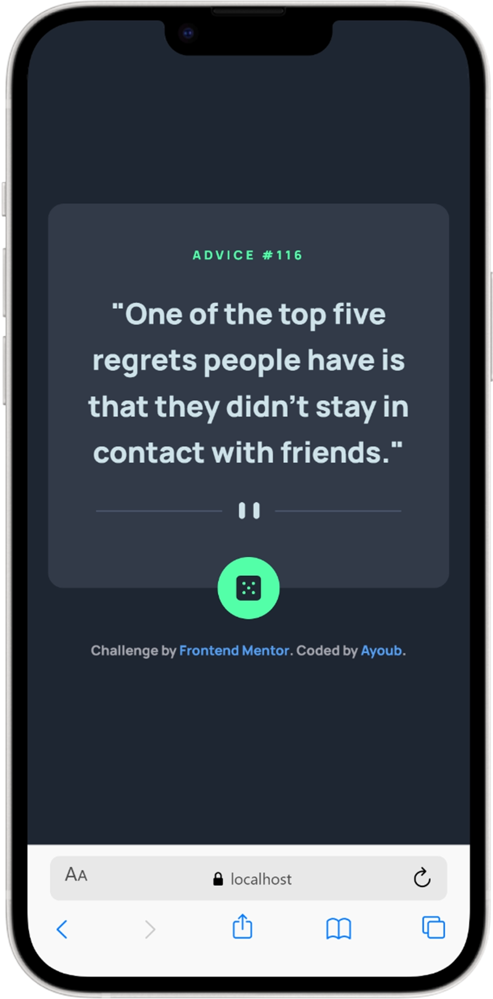

# Frontend Mentor - Advice generator app solution

This is a solution to the [Advice generator app challenge on Frontend Mentor](https://www.frontendmentor.io/challenges/advice-generator-app-QdUG-13db). Frontend Mentor challenges help you improve your coding skills by building realistic projects.

## Table of contents

- [Overview](#overview)
  - [The challenge](#the-challenge)
  - [Screenshot](#screenshot)
  - [Links](#links)
- [My process](#my-process)
  - [Built with](#built-with)
  - [What I learned](#what-i-learned)
  - [Continued development](#continued-development)
- [Author](#author)

## Overview

### The challenge

Users should be able to:

- View the optimal layout for the app depending on their device's screen size
- See hover states for all interactive elements on the page
- Generate a new piece of advice by clicking the dice icon

### Screenshot

### Links

- Solution URL: [https://www.frontendmentor.io/solutions/advice-generator-app-using-react-DpvwdHHUnR]
- Live Site URL: [https://ayoubsasi20.github.io/Advice-generator-app/]

## My process

### Built with

- Semantic HTML5 markup
- CSS custom properties
- Flexbox & Mobile-first workflow
- [React](https://reactjs.org/) - JS library
- [Vite](https://vitejs.dev/) - Frontend Tooling
- **Advice Slip JSON API** - For generating random quotes

### What I learned

This project marked my transition from building static UIs to developing interactive web applications. I learned how to handle side effects and data fetching in React.

**- Managing State & API Fetching:**
I utilized `useState` to manage the advice data and the loading state, and `useEffect` to fetch an initial piece of advice as soon as the component mounts.

### Continued development

In future projects, I want to dive deeper into:

Handling more complex APIs with multiple endpoints.

Exploring tools like Axios or React Query for advanced data fetching.

## Author

- Frontend Mentor - @AyoubSasi20 (https://www.frontendmentor.io/profile/AyoubSasi20)
